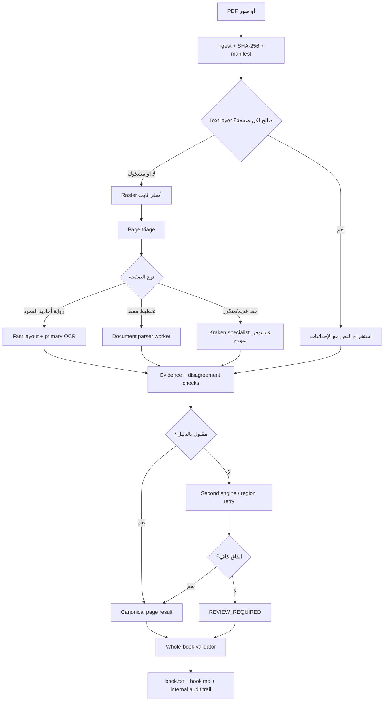

# تصميم خط أنابيب OCR عربي احترافي — V2

تاريخ التحليل: **2026-10-03**.

هذه الوثيقة تحوّل دراسة المحركات الحديثة إلى تصميم هندسي قابل للتنفيذ داخل
`bookocr`. هي لا تدّعي أن أي محرك فاز على كتب المشروع؛ لم يُشغّل Benchmark
جديد لهذا التحليل. اختيار المحرك النهائي يجب أن تحسمه مجموعة Ground Truth
الخاصة بالمشروع وفق البوابة الموجودة في
[`CURRENT_STATUS.md`](CURRENT_STATUS.md).

## الخلاصة التنفيذية

أفضل تصميم ليس تشغيل PaddleOCR وQARI وKraken وMonkeyOCR وQianfan على كل
صفحة. ذلك سيكون بطيئًا، مكلفًا، ويزيد فرص الهلوسة والتعارض. التصميم الأنسب
هو **routed ensemble**:

1. استخراج النص الأصلي الصالح من PDF إن وُجد.
2. تصنيف الصفحة وتخطيطها مع الاحتفاظ بالصورة الأصلية غير المعدلة.
3. تشغيل محرك أساسي سريع اختير بقياس حقيقي على نوع الصفحة.
4. قياس الاكتمال والخلاف والمخاطر، لا `confidence` وحده.
5. تشغيل محرك ثانٍ فقط على المناطق أو الصفحات المشكوك فيها.
6. قبول الناتج المتفق عليه، أو إبقاء الصفحة للمراجعة البشرية عند عدم وجود
   دليل كافٍ. لا يختار LLM النص الأكثر سلاسة لغويًا.

الترشيح الأولي للروايات المطبوعة في هذا المشروع:

- **Primary candidates:** PaddleOCR-VL-1.6، MonkeyOCRv2-Parsing، والمسار
  الحالي PP-OCRv5 العربي.
- **Arabic adjudicator:** QARI v0.3 بعد إصلاح HTML/footer وتشغيله في worker
  مستقل. تُقاس v0.4 ولا تُفترض أفضليتها؛ بطاقتها نفسها تعرض WER 25.62% على
  تقييمها الخاص.
- **Trainable specialist:** Kraken للكتب أو الخطوط المتكررة عندما تتوفر
  سطور مصححة كافية.
- **Complex-layout lab:** Qianfan-OCR وChandra 2 للصفحات المعقدة وعلى عتاد
  أكبر أو خدمة منفصلة، وليس كافتراضي على RTX 3050 Ti بذاكرة 4 GB.
- **Layout:** fast path هندسي للرواية أحادية العمود، مع PaddleOCR-VL أو
  MonkeyOCR أو Surya كـ fallback للصفحات المعقدة. Surya الحالي لا ينبغي أن
  يبقى محمّلًا مع VLM آخر على GPU نفسه.

## ما تثبته الدراسة وما لا تثبته

| الادعاء | الحكم الهندسي |
|---|---|
| PaddleOCR-VL-1.6 يدعم العربية و109 لغات، وحجمه 0.9B. | مثبت في التوثيق الرسمي. نتيجة 96.3 على OmniDocBench v1.6 ليست 96.3% دقة كلمات عربية. |
| MonkeyOCRv2 يدعم العربية ضمن 17 لغة وله Parsing بحجم 0.6B/0.7B. | مثبت رسميًا. درجات MDPBench تقيس document parsing متعدد الجوانب وليست CER/WER عربية. |
| Qianfan-OCR نموذج 4B ويدعم 192 لغة. | مثبت كادعاء رسمي. سرعة 1.024 صفحة/ثانية مقاسة على A100 W8A8، فلا تُستخدم لتقدير الجهاز الحالي. مستودع الكود MIT؛ يجب تدقيق ترخيص الوزن المحدد قبل التوزيع. |
| Chandra 2 قوي للمستندات المعقدة. | مرشح مختبر جيد، لكنه 5.3B في جداول المقارنة الرسمية ويتطلب عادة عتادًا أكبر. الكود Apache-2.0 والأوزان Modified OpenRAIL-M بشروط تجارية. |
| QARI متخصص بالعربية. | سبب قوي لإدخاله الاختبار، لا سبب لقبوله تلقائيًا. v0.3 غير مقاس محليًا قياسًا صالحًا، وv0.4 لا يتفوق بالضرورة عليه. |
| Kraken مهم للكتب القديمة والمتكررة. | صحيح عندما يُدرّب أو يُختار له نموذج مناسب لنوع الطباعة؛ تثبيت Kraken وحده ليس حلًا. |
| KITAB-Bench يحسم أفضل محرك للروايات. | غير صحيح. هو مهم جدًا ويضم 8,809 عينة ومهام متعددة، لكنه لا يستبدل corpus روايات المشروع ولا يقارن الإصدارات الحديثة كلها تحت إعداد واحد. |
| دعم العربية يعني دقة عربية ممتازة. | غير صحيح. الدعم قد يعني وجود script في tokenizer أو بيانات محدودة فقط. يلزم CER/WER واكتمال وترتيب قراءة على بياناتنا. |

المصادر الرسمية الأساسية:

- [PaddleOCR](https://github.com/PaddlePaddle/PaddleOCR)
- [MonkeyOCRv2](https://github.com/Yuliang-Liu/MonkeyOCRv2)
- [QARI-OCR models](https://huggingface.co/collections/NAMAA-Space/qari-ocr-a-high-accuracy-model-for-arabic-optical-character)
- [Kraken](https://github.com/mittagessen/kraken)
- [Qianfan-VL/Qianfan-OCR](https://github.com/baidubce/Qianfan-VL)
- [Chandra OCR](https://github.com/datalab-to/chandra)
- [Surya](https://github.com/datalab-to/surya)
- [KITAB-Bench](https://github.com/mbzuai-oryx/KITAB-Bench)

## المعمارية المقترحة



## المراحل بالتفصيل

### 1. Ingest وprovenance

- حساب SHA-256 لمحتوى المصدر، لا الاكتفاء بالمسار والحجم و`mtime`.
- تسجيل عدد الصفحات، metadata، hash، حجم الملف، وأداة فتح PDF وإصدارها.
- منع خلط مصدرين في output واحد، مع migration واضحة للحالة القديمة.
- عدم إدخال PDFs أو Ground Truth المحمي بحقوق النشر إلى Git.

### 2. Page triage

لكل صفحة يُسجّل:

- هل توجد text layer؟ وهل هي سليمة أم junk/جزئية؟
- DPI الفعلي، الاتجاه، الميل، الضوضاء، التباين، ونسبة الحبر.
- single-column / multi-column / table / illustration / form / manuscript.
- وجود تشكيل كثيف، أرقام، Latin spans، حواشٍ أو footer.

المعالجة يجب أن تكون conditional. يُحتفظ دائمًا بالـ raster الأصلي، وكل
نسخة معالجة تحمل recipe/hash مستقلًا للمقارنة وإعادة الإنتاج.

### 3. Layout قبل recognition

- الرواية النظيفة أحادية العمود تستخدم fast path محافظًا: حدود body، header،
  footer، page number، ثم ترتيب RTL هندسي.
- الصفحة المعقدة تُرسل إلى parser مثل PaddleOCR-VL أو MonkeyOCRv2.
- Surya يبقى خيار layout، لكن في worker مستقل لأن خادمه يحتفظ بذاكرة GPU.
- لا يُحذف footer أو watermark اعتمادًا على الموضع وحده؛ يلزم نوع المنطقة
  والتكرار عبر الصفحات، وتُحفظ العناصر المحذوفة في audit trail.

### 4. Recognition adapters

كل محرك يعمل خلف contract موحّد، ويفضل في process/container مستقل:

```text
recognize(page_image, regions, options) ->
  engine_id, model_revision, raw_output, regions[], text,
  native_scores?, runtime, peak_memory, warnings, artifacts
```

العزل مطلوب لأن PaddlePaddle وTorch وvLLM وKraken قد تتعارض تبعياتها، ولأن
GPU 4 GB لا يحتمل عدة نماذج VLM متزامنة. لا يُحمّل أكثر من GPU worker ثقيل
في الوقت نفسه على الجهاز الحالي.

### 5. Routing لاختيار المحرك

الـ router يقرأ profile الصفحة ونتائج Benchmark الخاصة بالمشروع:

| صفحة | Primary مبدئي | Escalation مبدئي |
|---|---|---|
| رواية حديثة أحادية العمود | الفائز بين PP-OCRv5 وPaddleOCR-VL وMonkeyOCRv2 | QARI v0.3 على المناطق المختلف عليها |
| تشكيل كثيف/خط عربي خاص | QARI أو Kraken إذا أثبت القياس ذلك | محرك مستقل ثانٍ + مراجعة |
| كتاب قديم بخط متكرر | Kraken model مخصص | PaddleOCR-VL أو QARI |
| أعمدة/جداول/نماذج | PaddleOCR-VL أو MonkeyOCRv2 | Qianfan/Chandra على عتاد مناسب |
| text layer سليمة | extractor بلا OCR | OCR فقط للتحقق بالعينة أو عند فشل الاكتمال |

هذه defaults بحثية وليست سياسة إنتاج حتى تظهر نتائج Ground Truth.

### 6. Disagreement وquality evidence

الـ scorer الحالي يحتاج أن يصبح evidence collector، لا رقمًا واحدًا مضللًا.
تُسجّل إشارات منفصلة:

- coverage: عدد المناطق والسطور والحروف ونسبة المساحة المغطاة.
- engine disagreement بعد محاذاة السطور مكانيًا.
- فقدان punctuation أو digits أو Latin spans.
- repetition loops، truncation، HTML leakage، وتغير طول غير منطقي.
- reading-order constraints والتداخل/الفجوات في المناطق.
- footer/body leakage، duplicate pages، missing pages.
- native confidence إن وُجد، مع وسم مصدره ومعايرته. VLM بلا confidence أصلي
  لا يُمنح accuracy مصطنعة من token probability.

قرار الصفحة يكون `ACCEPTED` أو `REVIEW_REQUIRED` أو `FAILED`. لا تُدمج
كلمات من محركين على مستوى النص الحر إلا بعد محاذاة المنطقة/السطر ووجود
قاعدة deterministic قابلة للتدقيق.

### 7. Post-processing محافظ

- حفظ `raw_output` لكل محرك قبل أي تعديل.
- Unicode NFC وضبط المسافات في view منفصل، مع عدم تغيير الحروف أو الكلمات.
- إعادة بناء الفقرات من layout والمسافات العمودية؛ الحوار يبقى سطرًا مستقلًا.
- لا تصحيح إملائي تلقائي داخل النص canonical.
- أي نسخة لغوية مصححة تكون artifact اختياريًا منفصلًا ولا تستبدل OCR.

### 8. State وartifacts

البنية المقترحة داخل `<output>/.ocr_internal/`:

```text
manifest.json                 source hash, config, code/model revisions
state.db                      jobs, attempts, status transitions
events.jsonl                  append-only lifecycle events
pages/000001/
  triage.json                 page profile and preprocessing recipes
  layout.json                 canonical regions and reading order
  candidates/
    paddle-v5.json            untouched engine result
    paddle-vl-1.6.json
    qari-v0.3.json
  decision.json               why one result was accepted or reviewed
qc_report.json                aggregate evidence, never called accuracy
```

يبقى المنتج العام `book.txt` و`book.md`. المعلومات التشخيصية لا تختلط
بالنص النهائي.

### 9. Whole-book validation

قبل اعتبار الكتاب مكتملًا:

- تطابق عدد الصفحات وعدم وجود gaps أو duplicate canonical records.
- كل صفحة `ACCEPTED` أو `REVIEW_REQUIRED` أو `BLANK` صراحةً.
- عدم وجود attempt عالق في `PROCESSING`.
- التحقق من page markers، UTF-8، وإمكانية إعادة بناء المنتج من السجل.
- تقرير الصفحات ذات الخلاف أو الانخفاض أو المعالجة بمحرك بديل.

## مختبر التقييم الصحيح

### Corpora

1. **Synthetic regression:** الموجود حاليًا، لضبط regressions المعروفة.
2. **Project novels:** 8-10 كتب، صفحات ممثلة، تفريغ بشري مزدوج المراجعة.
3. **KITAB-Bench subset:** printed text/layout فقط للمقارنة الخارجية.
4. **OpenITI OCR Gold Standard:** بعد تدقيق تطابق نوع الطباعة والترخيص.
5. **Historical/manuscript set:** منفصل تمامًا؛ لا يخلط مع قرار الروايات.

### Metrics

- strict/loose CER وWER، مع WER strict بوابة 97%.
- punctuation recall لكل علامة، digits/Latin recall، وdiacritic metrics.
- region coverage، reading-order accuracy، header/footer precision/recall.
- hallucinated text rate، omission rate، repeated-text rate.
- seconds/page، peak RAM/VRAM، disk/page، failure/retry rate.
- النتائج per-book/per-font/per-page-type، لا المتوسط العام وحده.

### Benchmark protocol

- تثبيت source hashes وreference version وnormalisation rules.
- تثبيت model revision وprompt وdecoding parameters وdependency lock.
- منع tuning على acceptance split.
- كل adapter يخرج raw result ثم evaluator موحد؛ لا يُسمح لكل مشروع بحساب
  مقياسه بطريقته ثم مقارنة الأرقام مباشرة.
- حساب التكلفة على cold start وwarm steady state كلٌ على حدة.

## ترتيب التجارب المقترح

| الجولة | المحركات | الهدف | شرط الاستمرار |
|---|---|---|---|
| 0 | PP-OCRv5 الحالي | تثبيت baseline القابل لإعادة الإنتاج | نفس corpus والبروتوكول |
| 1 | PaddleOCR-VL-1.6، MonkeyOCRv2-S/B | اختيار أفضل primary محلي للروايات | تحسن WER/coverage دون هلوسة أو تجاوز العتاد |
| 2 | QARI v0.3 وv0.4 | اختيار Arabic adjudicator | قياس صارم + معالجة HTML/footer + runtime مقبول |
| 3 | Kraken pretrained ثم fine-tuned | تحديد فائدة التخصص بالخط | split منفصل وتحسن ثابت لكل خط/سلسلة |
| 4 | Qianfan، Chandra، بدائل ثقيلة | complex-layout/offline lab | عتاد مناسب وترخيص مقبول وفائدة تتجاوز المحلي |

لا تبدأ جولة جديدة لأن النموذج أحدث؛ تبدأ فقط إذا كان لها سؤال قياس واضح.

## التغييرات المطلوبة في الكود الحالي

| البند | الحالة في 2026-10-03 |
|---|---|
| `EngineRegistry` وworker دائم | منفذ؛ `spawn` process افتراضي وin-process للاختبار. البيئة ما زالت مشتركة وليست container/venv مستقلة لكل محرك. |
| توسيع `EngineResult` | منفذ لـconfidence الاختياري وrevision وraw وruntime ونوع المخرج والتحذيرات؛ peak memory لم ينفذ بعد. |
| `EscalationPolicy` مستقل | منفذ بسياسة محافظة تستخدم الجودة والخلاف وHTML leakage. |
| `Validator` و`JobManager` | Validator منفذ ومربوط؛ JobManager ما زال غير منفذ. |
| `PageProfile`/`CandidateResult`/`DecisionRecord` | منفذة وتُحفظ كـJSON قابل للتدقيق. |
| فصل layout/recognition | العقد منفصل والنتائج canonical؛ layout نفسه ما زال يعمل في العملية الرئيسية. |
| SHA-256 للمصدر | منفذ مع إبقاء metadata fingerprint للتوافق. |
| revisions وlockfiles لكل worker | model revision محفوظ حين يقدمه adapter؛ prompt/decoder locks وبيئات workers المقفلة لم تنفذ. |
| benchmark harness موحد | لم ينفذ في هذه الجولة ولم يُشغّل Benchmark. |
| توافق `book.txt` و`book.md` وmigration | منفذ؛ schema جديد يضاف داخل `.ocr_internal` مع migration لـSQLite. |

كما نُفذت بوابة text layer لكل صفحة، attempts في SQLite، events fsynced،
أوامر `audit` و`validate`، واختبارات fake-engine لا تشغّل أي نموذج. التفاصيل
الدقيقة في [`V2_IMPLEMENTATION_LOG.md`](V2_IMPLEMENTATION_LOG.md).

## بوابات التنفيذ

### Gate A — البنية قبل النماذج

- schema موحد، workers معزولة، provenance كامل، raw artifacts، وvalidator.
- لا تغيير للمحرك الأساسي ولا ادعاء تحسن دقة.

**الحالة:** الأساس منفذ ومتحقق باختبارات model-free. العزل الحالي process
وليس بيئة تبعيات مستقلة، وlayout لم يُنقل إلى worker بعد؛ لذلك Gate A
مكتملة كأساس برمجي وليست مكتملة كحزمة نشر إنتاجية متعددة المحركات.

### Gate B — اختيار primary

- Benchmark مصرح به على synthetic + development real set.
- مقارنة PaddleOCR-VL وMonkeyOCRv2 وPP-OCRv5 بإعداد موحد.
- اختيار محرك واحد حسب Pareto: الدقة، الاكتمال، الهلوسة، السرعة، والذاكرة.

### Gate C — escalation

- QARI/المحرك الثاني يحسن الصفحات الصعبة فعليًا.
- policy مبنية على disagreement ومخاطر قابلة للرصد.
- أي خلاف غير محسوم ينتقل للمراجعة البشرية.

### Gate D — 97%+

- اجتياز جميع شروط `CURRENT_STATUS.md` على acceptance split غير مستخدم في
  التطوير، مع نشر التقرير والإصدارات والإعدادات.

## قرارنا الحالي

نحتفظ بالمحرك الحالي كـbaseline، وقد بُنيت طبقة Gate A حوله دون تشغيل نموذج
أو Benchmark. الخطوة التالية ليست إعلان محرك فائز، بل إكمال عزل تبعيات كل
worker وإضافة adapters مرشحة ثم قياسها على development corpus مصرح به. لا
تتغير حقيقة أن 97%+ غير مثبتة حتى اجتياز Gate D.
